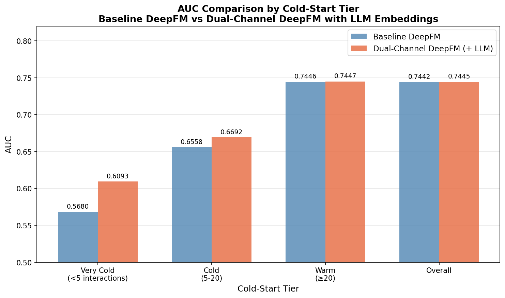
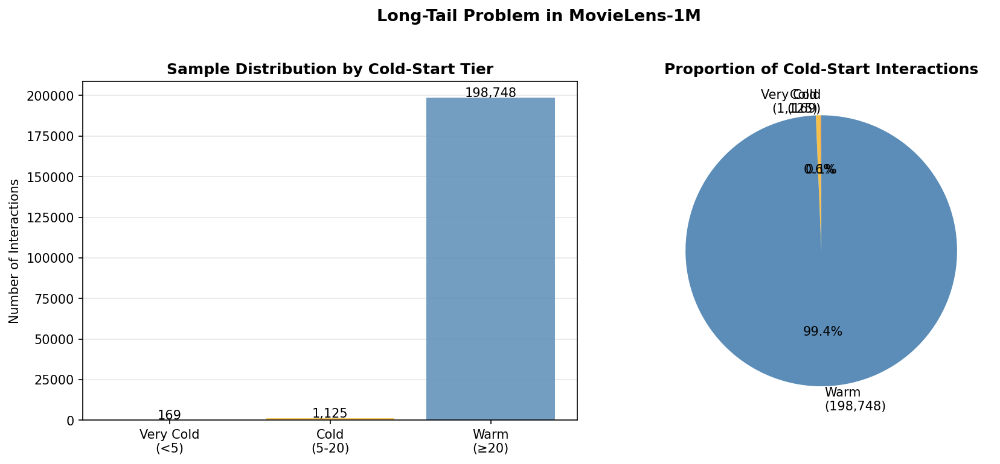
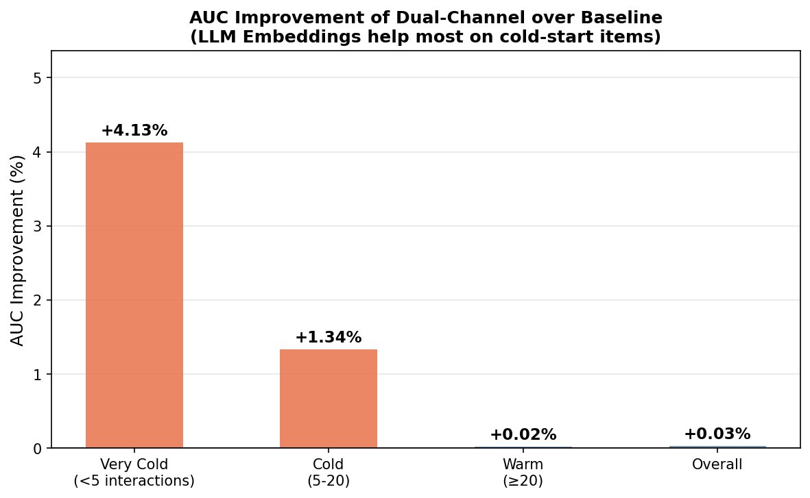

# DeepFM-CTR

Dual-channel DeepFM with LLM semantic embeddings for cold-start CTR prediction on MovieLens-1M.

## 核心思路

将电影标题和类型通过 LLM 转为语义 embedding（1024维），作为 **冻结的稠密特征** 拼接到 Dual-Channel DeepFM 的第二个通道中，缓解冷启动用户/物品的 AUC 衰退问题。

## 实验结果

| Tier | Baseline DeepFM | Dual-Channel (+ LLM) | Δ AUC |
|------|:-:|:-:|:-:|
| Very Cold (<5 interactions) | 0.5680 | **0.6093** | **+4.13%** |
| Cold (5-20) | 0.6558 | **0.6692** | **+1.34%** |
| Warm (≥20) | 0.7446 | 0.7447 | +0.02% |
| **Overall** | 0.7442 | 0.7445 | +0.03% |

**关键结论：** LLM 语义 embedding 对冷启动物品提升显著（Very Cold +4.13%），对热启动物品基本持平，整体 AUC 提升微弱（+0.03%）但冷启动分层改善明显。

## 可视化图表

| 图 | 说明 |
|----|------|
|  | AUC 分层对比柱状图 |
|  | 冷启动分布图（长尾问题可视化） |
|  | 提升幅度图 |

## 项目结构

```
├── 1data_process.py             # 数据预处理
├── 2generate_embeddings.py      # 调用 LLM 生成语义 embedding
├── 3train_baseline.py           # Baseline DeepFM 训练
├── 4train_dualchannel.py        # Dual-Channel DeepFM 训练
├── 5evaluate_coldstart.py       # 冷启动分层评估 + 可视化
├── deepfm_baseline.py           # DeepFM 模型定义
└── run_deepfm.py                # 运行入口
├── results/
│   ├── baseline_pred.csv
│   └── dual_pred.csv
├── figures/
│   ├── fig1_auc_comparison.png
│   ├── fig2_coldstart_distribution.png
│   └── fig3_auc_improvement.png
└── README.md
```
