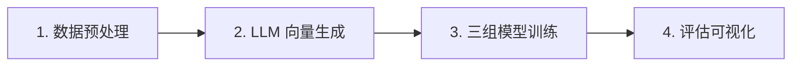
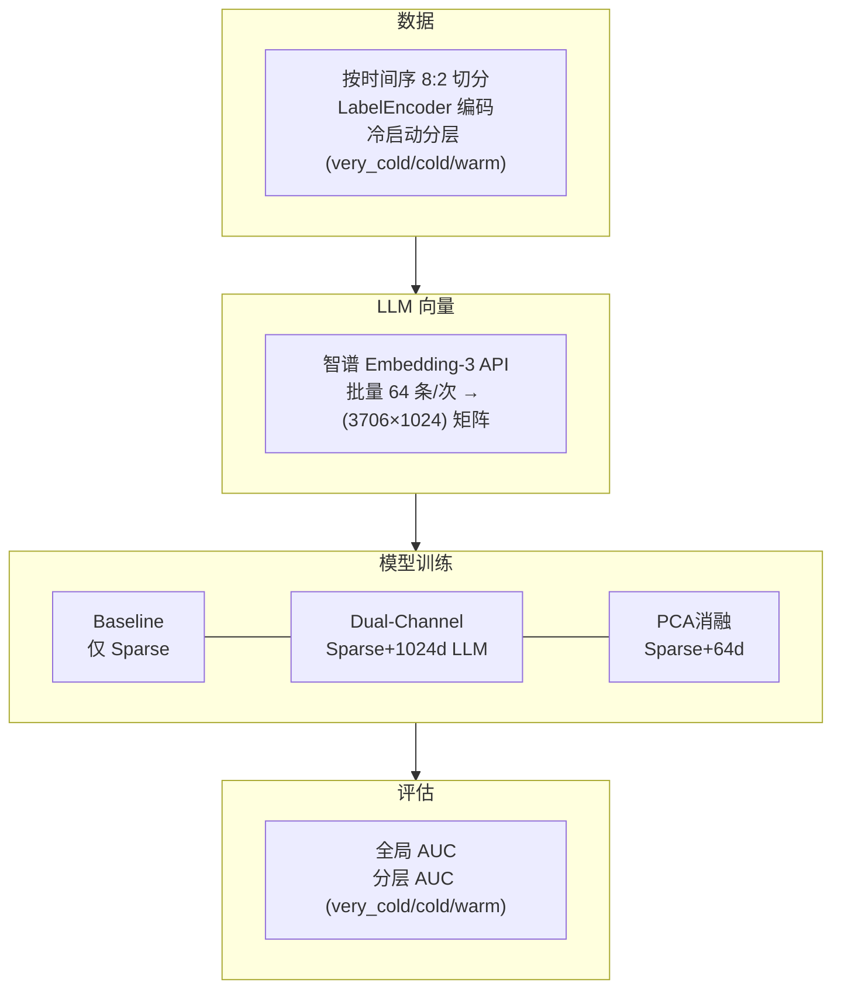
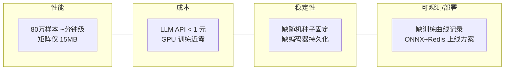

# DeepFM-CTR

Dual-channel DeepFM with LLM semantic embeddings for cold-start CTR prediction on MovieLens-1M.

## 项目总览（三层架构）

**第1层 — 功能层：Pipeline 流程**

```mermaid
flowchart LR
    A[1. 数据预处理] --> B[2. LLM 向量生成] --> C[3. 三组模型训练] --> D[4. 评估可视化]
```

**第2层 — 系统层：模块分工与三组对比**

```mermaid
flowchart TB
    subgraph Data[数据]
        M1["按时间序 8:2 切分<br/>LabelEncoder 编码<br/>冷启动分层 (very_cold/cold/warm)"]
    end
    subgraph LLM[LLM 向量]
        M2["智谱 Embedding-3 API<br/>批量 64 条/次 → (3706×1024) 矩阵"]
    end
    subgraph Train[模型训练]
        direction LR
        T1["Baseline<br/>仅 Sparse"] --- T2["Dual-Channel<br/>Sparse+1024d LLM"] --- T3["PCA消融<br/>Sparse+64d"]
    end
    subgraph Eval[评估]
        M4["全局 AUC<br/>分层 AUC (very_cold/cold/warm)"]
    end
    Data --> LLM --> Train --> Eval
```

**第3层 — 工程层：上线考量**

```mermaid
flowchart LR
    subgraph Perf[性能]
        P1["80万样本 ~分钟级<br/>矩阵仅 15MB"]
    end
    subgraph Cost[成本]
        P2["LLM API < 1 元<br/>GPU 训练近零"]
    end
    subgraph Stable[稳定性]
        P3["缺随机种子固定<br/>缺编码器持久化"]
    end
    subgraph Ops[可观测/部署]
        P4["缺训练曲线记录<br/>ONNX+Redis 上线方案"]
    end
    Perf --- Cost --- Stable --- Ops
```

## 核心思路

将电影标题和类型通过 LLM 转为语义 embedding（1024维），作为 **冻结的稠密特征** 拼接到 Dual-Channel DeepFM 的第二个通道中，缓解冷启动用户/物品的 AUC 衰退问题。

## 实验结果

| Tier | Baseline DeepFM | Dual-Channel (1024d) | PCA消融 (64d) | Δ 1024-PCA |
|------|:-:|:-:|:-:|:-:|
| Very Cold (<5) | 0.5680 | **0.6093** | 0.6018 | +0.0075 |
| Cold (5-20) | 0.6558 | **0.6692** | 0.6673 | +0.0019 |
| Warm (≥20) | 0.7446 | 0.7447 | 0.7445 | +0.0003 |
| **Overall** | 0.7442 | **0.7445** | 0.7442 | +0.0003 |

**关键结论：**
- **LLM embedding 有效**：1024维双通道在冷启动层显著提升（Very Cold +4.13%），热启动基本持平
- **PCA 降维有损**：1024→64维压缩后冷启动增益折半以上（Very Cold 从 +4.13% 降至 +3.38%），说明语义信息的完整性对冷启动很重要

## 可视化图表

| 图 | 说明 |
|----|------|
|  | AUC 分层对比柱状图 |
|  | 冷启动分布图（长尾问题可视化） |
|  | 提升幅度图 |

## 项目结构

```
├── 1data_process.py             # 数据预处理
├── 2generate_embeddings.py      # 调用 LLM 生成语义 embedding
├── 3train_baseline.py           # Baseline DeepFM 训练
├── 4train_dualchannel.py        # Dual-Channel DeepFM 训练
├── 5evaluate_coldstart.py       # PCA消融实验（对比验证）
├── results/
│   ├── baseline_pred.csv
│   ├── dual_pred.csv
│   └── pca_pred.csv
├── figures/
│   ├── fig1_auc_comparison.png
│   ├── fig2_coldstart_distribution.png
│   └── fig3_auc_improvement.png
└── README.md
```
